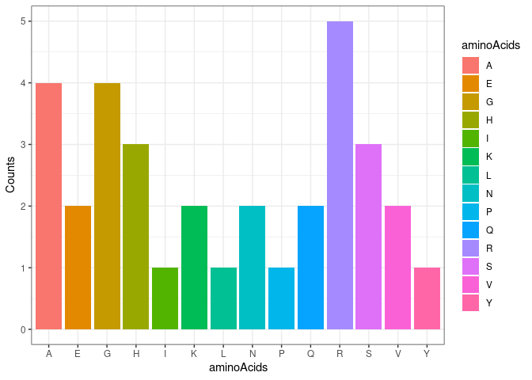

<!-- README.md is generated from README.Rmd. Please edit that file -->

*Group 11*  
*Github repository*:
<https://github.com/rforbiodatascience22/group_11_package>

# Description of the package

When you purify and sequence DNA, you may want to: \* Transcribe the DNA
sequence to RNA. \* Get the codons corresponding to the translated RNA.
\* Analyse the frequency of the codons in your peptide.

The `CentralDogma` allows you to perform such analysis and also offers
the possibility to create a random DNA sequence to practice with its set
of tools.

## Creating a random DNA sequence with `randomDNASequence`

`randomDNASequence` takes the length of the DNA sequence as argument and
returns a random selection of nucleotides.

For example, we can opt to create a DNA sequence comprised of 100
nucleotides and assign it to a variable:

``` r
dnaSequence <- randomDNASequence(100)
dnaSequence
#> [1] "AACTATTTCGAGGCAATACGCTAGCGCTATTAATCGTCCCTGAGCGATATAGAATCAATATACGATTAACACTATATATGTAATATCACCCGTCTGAAAA"
```

## Transcribing our DNA sequence with `DnaToRna`

After creating the random DNA sequence or obtaining it elsewhere,
`DnaToRna` takes the variable containing the nucleotides as input and
transcribes it to RNA.

``` r
rnaSequence <- DnaToRna(dnaSequence)
rnaSequence
#> [1] "AACUAUUUCGAGGCAAUACGCUAGCGCUAUUAAUCGUCCCUGAGCGAUAUAGAAUCAAUAUACGAUUAACACUAUAUAUGUAAUAUCACCCGUCUGAAAA"
```

## Detecting the codons in the RNA strand with `getCodons`

`getCodons` allows to divide the strand of RNA into its composing
3-nucleotide codons.

``` r
codonSequence <- getCodons(rnaSequence)
codonSequence
#>  [1] "AAC" "UAU" "UUC" "GAG" "GCA" "AUA" "CGC" "UAG" "CGC" "UAU" "UAA" "UCG"
#> [13] "UCC" "CUG" "AGC" "GAU" "AUA" "GAA" "UCA" "AUA" "UAC" "GAU" "UAA" "CAC"
#> [25] "UAU" "AUA" "UGU" "AAU" "AUC" "ACC" "CGU" "CUG" "AAA"
```

## Translating the codon sequence into a peptide chain with `translateRNASequence`

The next step is translating the codon sequence to obtain the
polypeptide chain, and this is possible with `translateRNASequence`.

Importantly, if your codonSequence variable contained a STOP codon, it
will be represented with an asterisk \* in the output.

``` r
peptideSequence <- translateRNASequence(codonSequence)
peptideSequence
#> [1] "NYFEAIR*RY*SSLSDIESIYD*HYICNITRLK"
```

## `plotFrequencies` analyses the frequency of amino acids in youor polypeptide chain

Finally, it is often relevant to estimate the number of the different
amino acids in order to understand the chemicophysical properties of
your protein. `plotFrequencies` will generate a barplot to display this
information.

Importantly, if your polypeptide chains contains a STOP (\*), it should
be removed before plotting the data.

``` r
plotFrequencies(peptideSequence)
```


